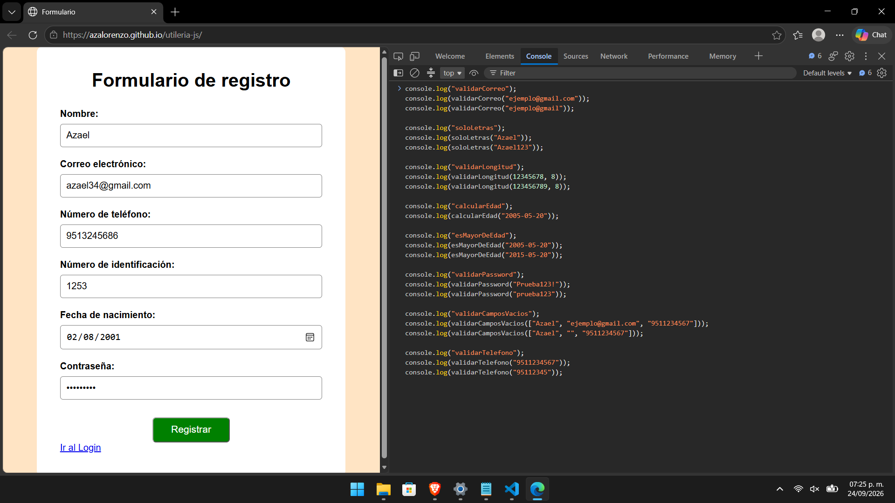
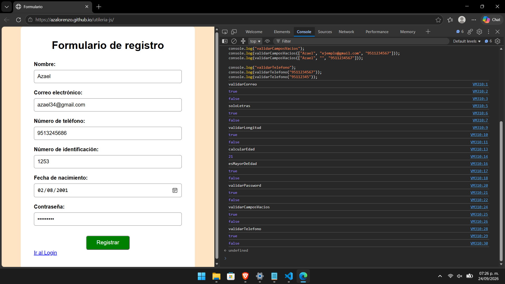
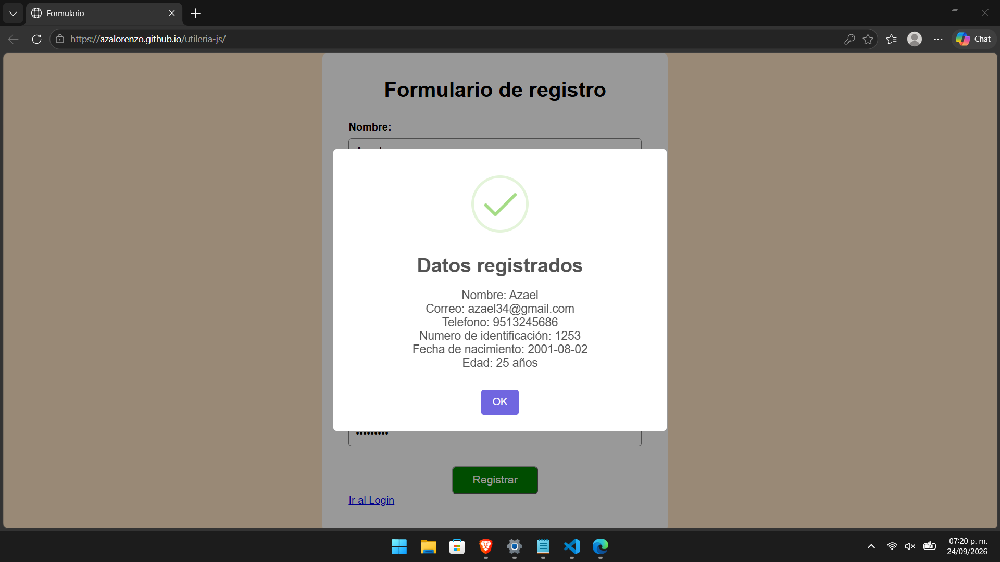
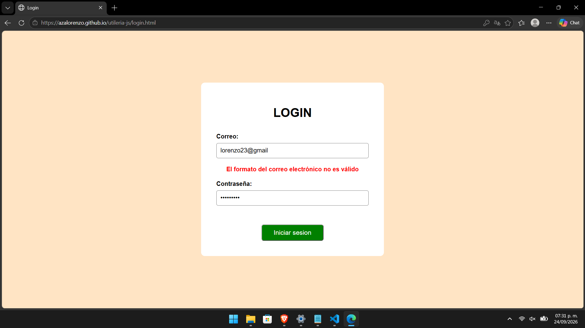
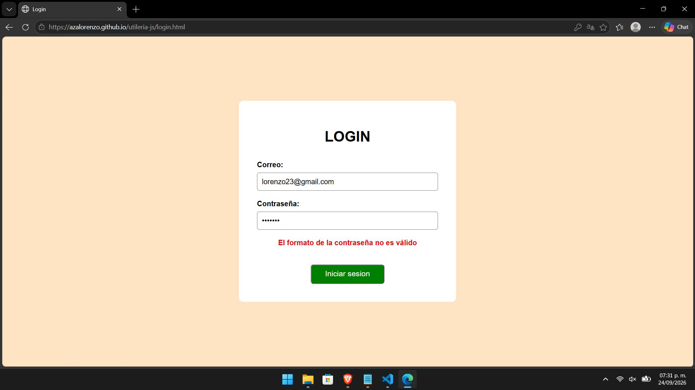

# Librería de Utilerías en JavaScript

**Nombre:** Azael Chavez Lorenzo  
**Materia:** Programación Web

## Descripción

Esta librería fue creada utilizando JavaScript y contiene distintas funciones reutilizables para realizar validaciones y cálculos dentro de una página web.

Su objetivo es facilitar la validación de datos ingresados por el usuario en formularios, evitando tener que estar repitiendo la misma lógica en diferentes partes de un proyecto.

La librería permite realizar tareas como:

- Validar correos electrónicos.
- Validar que un texto contenga solamente letras.
- Validar la longitud máxima de un número.
- Calcular la edad a partir de una fecha de nacimiento.
- Comprobar si una persona es mayor de edad.
- Validar contraseñas.
- Comprobar que un conjunto de campos no esté vacío.
- Validar números telefónicos.

---

## Instalación

Primero se debe clonar este repositorio para obtener los archivos del proyecto:

```bash
git clone https://github.com/azalorenzo/utileria-js.git
```

Una vez clonado el repositorio, se debe localizar el archivo `utileria.js` y copiarlo dentro del proyecto donde se quiera utilizar la librería.

Después, para utilizar la librería se debe incluir el archivo `utileria.js` dentro del documento HTML.

```html
<script src="js/utileria.js"></script>
```

Es recomendable cargar la librería antes del archivo JavaScript que utilizará sus funciones. Por ejemplo:

```html
<script src="js/utileria.js"></script>
<script src="js/formulario.js"></script>
```

Esto es para que las funciones de `utileria.js` esten disponibles cuando sean llamadas desde otros archivos JavaScript.

---

## Uso

### Validar correo electrónico

La función `validarCorreo()` recibe un correo electrónico y devuelve `true` si tiene un formato válido o `false` en caso contrario.

```js
let correo = "ejemplo@gmail.com";

let resultado = validarCorreo(correo);

console.log(resultado);
```

Resultado:

```text
true
```

### Validar solo letras

La función `soloLetras()` comprueba que un texto contenga únicamente letras mayúsculas o minúsculas. También acepta vocales acentuadas y caracteres como `ñ`.

```js
let nombre = "Azael";

let resultado = soloLetras(nombre);

console.log(resultado);
```

Resultado:

```text
true
```

Si el texto contiene números, espacios u otros caracteres, la función devuelve `false`.

```js
let resultado = soloLetras("Azael123");

console.log(resultado);
```

Resultado:

```text
false
```

### Validar longitud

La función `validarLongitud()` comprueba que un número no supere una longitud máxima indicada.

```js
let numero = 12345678;

let resultado = validarLongitud(numero, 8);

console.log(resultado);
```

Resultado:

```text
true
```

### Calcular edad

La función `calcularEdad()` recibe una fecha de nacimiento y calcula la edad actual de la persona. El formato de fecha utilizado es `YYYY-MM-DD`.

```js
let fechaNacimiento = "2005-05-20";

let edad = calcularEdad(fechaNacimiento);

console.log(edad);
```

El resultado será un número entero correspondiente a la edad actual de la persona.

### Validar mayoría de edad

La función `esMayorDeEdad()` utiliza la fecha de nacimiento para determinar si una persona tiene 18 años o más.

```js
let fechaNacimiento = "2005-05-20";

let resultado = esMayorDeEdad(fechaNacimiento);

console.log(resultado);
```

Resultado:

```text
true
```

### Validar contraseña

La función `validarPassword()` comprueba que una contraseña tenga como mínimo 8 caracteres y que contenga una letra mayúscula, una letra minúscula, un número y un carácter especial.

```js
let password = "Prueba123!";

let resultado = validarPassword(password);

console.log(resultado);
```

Resultado:

```text
true
```

---

## Funciones adicionales

Además de las funciones obligatorias, se agregaron dos funciones adicionales para facilitar el trabajo con formularios.

### Validar campos vacíos

La función `validarCamposVacios()` recibe un conjunto de campos y comprueba que todos contengan información. Esta función permite realizar una sola validación para varios campos y reutilizarla en diferentes formularios.

```js
let nombre = "Azael";
let correo = "ejemplo@gmail.com";
let telefono = "9511234567";

let resultado = validarCamposVacios([nombre, correo, telefono]);

console.log(resultado);
```

Resultado:

```text
true
```

Y si alguno de los campos se encuentra vacío la funcion devuelve `false`:

```js
let nombre = "Azael";
let correo = "";
let telefono = "9511234567";

let resultado = validarCamposVacios([nombre, correo, telefono]);

console.log(resultado);
```

Resultado:

```text
false
```

### Validar teléfono

La función `validarTelefono()` comprueba que un número telefónico esté formado exactamente por 10 dígitos y que no contenga letras o símbolos.

```js
let telefono = "9511234567";

let resultado = validarTelefono(telefono);

console.log(resultado);
```

Resultado:

```text
true
```

---

## Capturas de pantalla

### Pruebas de las funciones en consola

En esta parte se muestran los resultados obtenidos al probar las funciones de la librería desde la consola del navegador.




### Formulario de registro

Captura que muestra la librería funcionando dentro del formulario de registro.



### Login

Capturas que muestran las validaciones implementadas en la página de inicio de sesión.




---

## Video demostrativo

En el siguiente video se muestra el funcionamiento de la librería, su integración y las validaciones realizadas.

▶️ [**Ver video demostrativo en YouTube**](https://youtu.be/6RLyLVr05KI)

[](https://youtu.be/6RLyLVr05KI)
